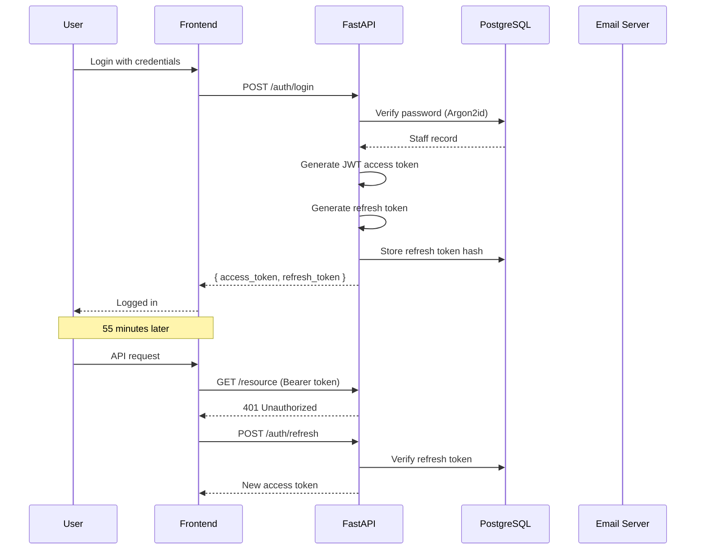
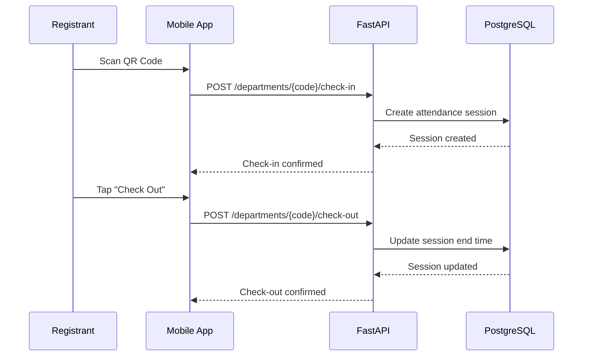
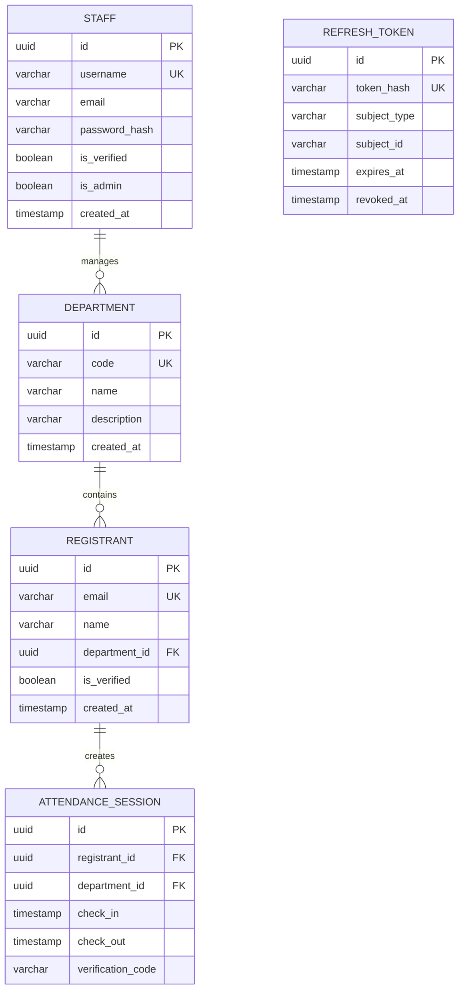

## System Overview

NIHUB Attendance System is a multi-tenant event attendance platform with QR code check-in/check-out functionality.

## Architecture Diagram

```mermaid
graph TB
    subgraph "Clients"
        Web["Web Dashboard<br/>(React)"]
        Mobile["Mobile App<br/>(Flutter)"]
    end

    subgraph "Reverse Proxy"
        Caddy["Caddy Server<br/:80/:443"]
    end

    subgraph "Backend"
        API["FastAPI Server<br/>Port 8000"]
        Routers["Routers"]
        Services["Services"]
        DB["PostgreSQL"]
    end

    Web --> Caddy
    Mobile --> Caddy
    Caddy --> |/api/*| API
    Caddy --> |/* (SPA)| Web
    API --> Routers
    Routers --> Services
    Services --> DB
```

## Component Breakdown

### 1. Backend (`server/`)

```
server/
├── main.py              # FastAPI entry point
├── routers/             # HTTP route handlers
│   ├── auth.py          # Staff & registrant auth
│   ├── departments.py    # Department CRUD
│   ├── attendance.py     # Check-in/check-out
│   ├── admin.py          # Admin operations
│   └── registrants.py    # Registrant management
├── services/            # Business logic
│   ├── staff_auth.py     # JWT auth service
│   ├── registrant_auth.py
│   ├── department_service.py
│   ├── attendance_service.py
│   └── email_service.py
├── models.py             # Pydantic models
├── db.py                 # Database connection
├── dependencies.py        # FastAPI dependencies
├── logging_config.py      # Structured logging
└── migrations/           # Alembic migrations
```

### 2. Frontend (`frontend/`)

```
frontend/
├── src/
│   ├── pages/           # React page components
│   ├── contexts/        # Auth context, axios interceptors
│   └── utils/           # API client, logger
├── vite.config.ts       # Vite with /api proxy
└── package.json
```

### 3. Mobile (`mobile/`)

```
mobile/
└── lib/
    ├── providers/       # Riverpod providers
    ├── models/          # Data models
    └── services/        # API service layer
```

## Tech Stack

| Component | Technology |
|-----------|-----------|
| Backend | FastAPI + Python 3.11+ |
| Database | PostgreSQL |
| Migrations | Alembic |
| Auth | JWT + Refresh Tokens |
| Frontend | React 19 + Vite + TypeScript |
| Mobile | Flutter + Riverpod |
| Reverse Proxy | Caddy 2 |
| Password Hashing | Argon2id |

## API Design

### Authentication Flow



### Department Attendance Flow



## Database Schema



## Security Architecture

### JWT Configuration

- **Access Token**: 60-minute expiry, HS256 signed
- **Refresh Token**: 30-day expiry, SHA256 hashed storage
- **Token Rotation**: Old refresh token revoked on use

### Password Security

- Argon2id with default parameters
- Memory-hard against GPU attacks
- Constant-time comparison

### CORS Configuration

```python
# Development (allowlist localhost)
allow_origins = [
    "http://localhost:8081",
    "http://localhost:8100",
]

# Production (should be restricted to specific domains)
```

## Deployment

### Docker Compose

```yaml
services:
  proxy:
    image: caddy:2
    ports:
      - "80:80"
    volumes:
      - ./Caddyfile:/etc/caddy/Caddyfile

  api:
    build: ./server
    environment:
      - DATABASE_URL=postgresql://user:pass@db:5432/nihub
      - JWT_SECRET=${JWT_SECRET}

  frontend:
    build: ./frontend
    # Served by Caddy

  db:
    image: postgres:16
```

## Logging Strategy

Structured JSON logging with request IDs:

```json
{
  "event": "request.end",
  "request_id": "550e8400-e29b-41d4-a716-446655440000",
  "method": "POST",
  "path": "/departments/code/check-in",
  "status": 200,
  "duration_ms": 45.23
}
